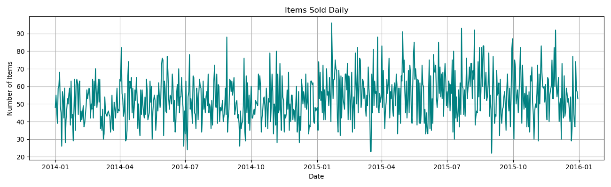
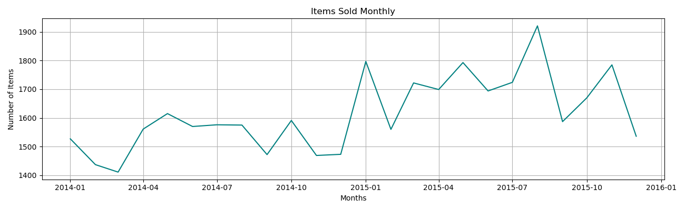
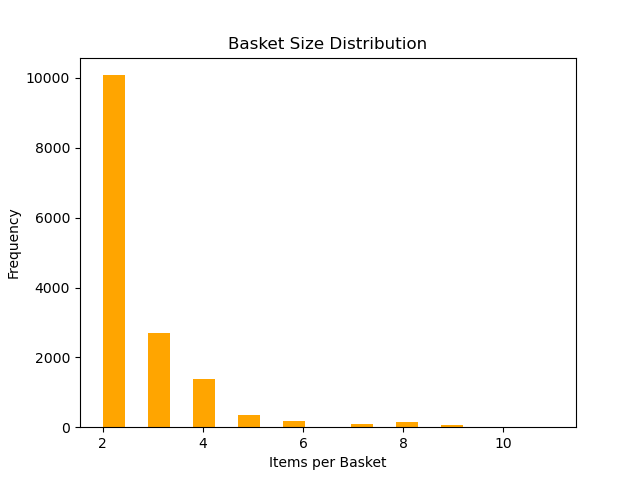
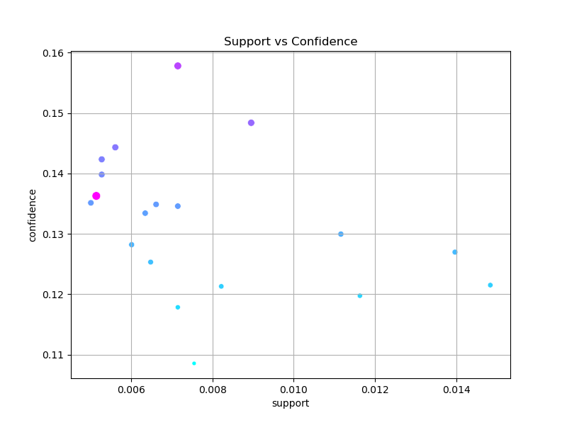

# Market Basket Analysis Project

This project focuses on uncovering **frequent itemsets** and **association rules** from a transactional grocery dataset using the **Apriori Algorithm**. It provides insights into customer purchasing behavior to aid in product placement, promotions, and cross-selling strategies.

---

## Project Structure

Market-Basket-Analysis/
│
├── Groceries_dataset/ # Raw dataset
├── images/ # Saved visualizations
├── Market Basket.ipynb # Main analysis notebook
├── README.md # Project overview and documentation


---

##  Exploratory Data Analysis (EDA)

- **Total Customers:** 3,898
- **Unique Product Categories:** 167
- **Date Range:** January 1, 2014 – December 30, 2015

### Top 10 Most Sold Items

| Rank | Item               | Frequency |
|------|--------------------|-----------|
| 1    | Whole Milk         | 2,502     |
| 2    | Other Vegetables   | 1,898     |
| 3    | Rolls/Buns         | 1,716     |
| 4    | Soda               | 1,514     |
| 5    | Yogurt             | 1,334     |
| 6    | Root vegetables	| 1,071     |
| 7    | Tropical fruit     | 1,032     |
| 8    | Bottled water      | 933       |
| 9    | Sausage	        | 924       |
| 10   | citrus fruit	    | 812       |

---


### Items Sold Over Time (Daily)



Shows seasonality and consistent shopping behavior across the two-year period.

---
### Items Sold Over Time (Monthly)



Shows seasonality and customer's shopping behavoiur over the months of the year.

---
###  Basket Size Distribution



Most baskets contain **2 to 3 items**, indicating that shoppers often make small purchases.

---

## Frequent Pattern Mining

- **Algorithm:** Apriori
- **Min Support:** 0.005
- **Min Confidence:** 0.1

### Top Frequent Itemsets

| Items                  | Support |
|------------------------|---------|
| Whole milk             | 15.79%  |
| Other vegetables       | 12.21%  |
| Rolls/buns             | 11.00%  |
| Soda                   | 9.71%   |
| Yogurt                 | 8.59%   |

---

## Association Rules

| Antecedent        | Consequent     | Confidence | Lift     |
|-------------------|----------------|------------|----------|
| Bottled beer      | Whole milk     | 15.78%     | 0.999    |
| Sausage           | Whole milk     | 14.84%     | 0.939    |
| Newspapers        | Whole milk     | 14.43%     | 0.913    |
| Frankfurter       | Whole milk     | 13.98%     | 0.885    |
| Frankfurter       | Vegetables     | 13.62%     | 1.116    |

These rules show **complementary item relationships**, helping retailers with bundling and shelf organization.

---

###  Support vs Confidence Plot



This scatter plot visualizes how strong rules (high confidence and lift) are distributed in terms of support.

---

## Key Insights

- **Whole milk** frequently co-occurs with many other items and appears in the majority of high-confidence rules.
- **Small baskets dominate**, with most transactions containing only a few items.
- **Lift < 1** in many rules implies weak or negative correlations, but some high-lift rules (like frankfurter → vegetables) are actionable.
- The model can help **optimize product placement** and develop **targeted promotions** based on item associations.

---

##  Tools & Libraries Used

- Python
- Pandas, NumPy
- Matplotlib, Seaborn
- mlxtend (Apriori, Association Rules)

---

## How to Run

1. **Clone the Repository**:
    ```bash
    git clone https://github.com/shailylitoriya/market-basket-analysis.git
    cd market-basket-analysis
    ```

2. **Install Dependencies**:
    ```bash
    pip install -r requirements.txt
    ```

3. **Run the Notebook**:
    ```bash
    jupyter notebook "Market Basket.ipynb"
    ```

---

## Author

**Shaily Litoriya**  
📧 shailylitoriya@gmail.com  
🔗 [GitHub](https://github.com/shailylitoriya) | [LinkedIn](www.linkedin.com/in/shailylitoriya)

---

## License

This project is open-source and available under the [MIT License](LICENSE).
